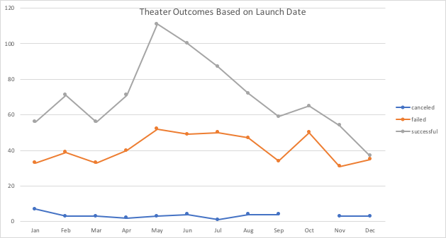

# Kickstarter-Analysis
Performing analysis on Kickstarter data to uncover trends
## Overview of Project 
This project analyzes the success & failures of different crowdfunding campaigns to understand what factors makes a successful campaign. The goal of this project is to give Louise, better insight on how she can start a crowdfunding campaign for her play, "Fever".
## Analysis and Challenges
### Analysis of Outcomes Based on Launch Date

This chart shows the outcome of a theater campaign based on its launch date. There are a few trends we can see from this chart. Cancelled campaigns appear to remain relatively the same throughout the year/different dates. We see an increase in successful campaigns that were launched from March – June, June being the month with the highest number of successful campaigns. After June, we see a continuous decline in successful campaigns, with December being the month with the least amount of successful campaigns. 
### Analysis of Outcomes Based on Goals
