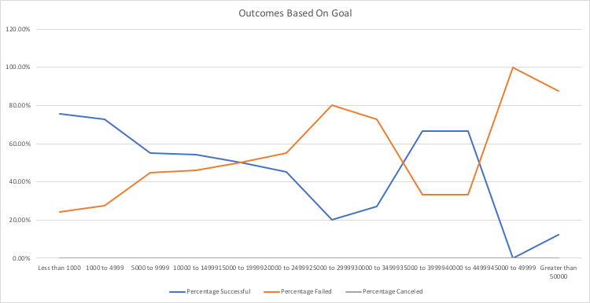

# Kickstarter-Analysis
Performing analysis on Kickstarter data to uncover trends
## Overview of Project 
This project analyzes the success & failures of different crowdfunding campaigns to understand what factors makes a successful campaign. The goal of this project is to give Louise, better insight on how she can start a crowdfunding campaign for her play, "Fever".
## Analysis and Challenges
### Analysis of Outcomes Based on Launch Date

This chart shows the outcome of a theater campaign based on its launch date. There are a few trends we can see from this chart. Cancelled campaigns appear to remain relatively the same throughout the year/different dates. We see an increase in successful campaigns that were launched from March – June, June being the month with the highest number of successful campaigns. After June, we see a continuous decline in successful campaigns, with December being the month with the least amount of successful campaigns. 
### Analysis of Outcomes Based on Goals

This line graph demonstrates the trends in success and failure, based on the crowdfunding goal. Overall, there were more successes than failures (694 successes vs. 353 failure campaigns) in crowdfunding. A successful campaign is one where the goal set was met or passed with the amount of money that was pledge. Successful campaigns on average had lower campaign goals by $5,505.33 compared to campaigns that failed. 
### Challenges and Difficulties Encountered
An initial challenge was editing or reformatting the data so that it was easier to utilize. Category & Subcategory were combined into one column, making it harder to look at more specifics between the two. After a simple reformat, I was able to breakdown each field into two separate columns. Additionally, dates were given in a format that was not understandable off the bat. Through a few steps, I was able to understand that this was saved as a Unix Timestep. Through some conversions, I was able to store the “Deadline” and “Launch Date” fields in a much easier way to understand. Through both of these initial reformatting steps, the data was significantly easier to use to view trends. 
